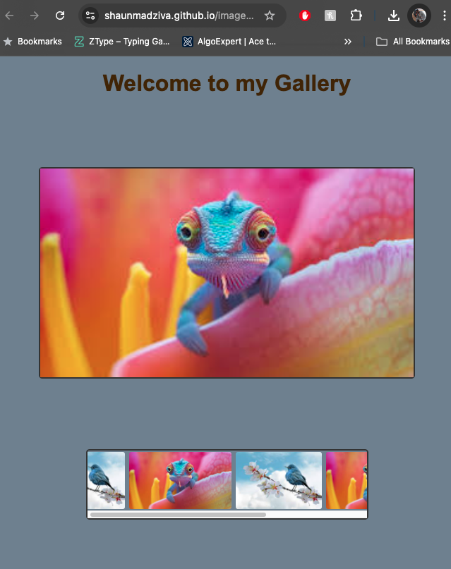

# This is a H1

## This is a H2

[Where is the H3](#h3)

- This
- is
- a
- list
  - with
  - some
  - indents

[This is a hyperlink](https://www.bbc.co.uk)

| This | Is   | A    | Table |
| ---- | ---- | ---- | ----- |
| with | some | rows | !     |

This is a `technichal term`

```js
function hello() {
  console.log("hello");
}
```

</br>



### Here is the H3

<details>
<summary> How do i do a dropdown</summary>
</br>
this is how
</details>
